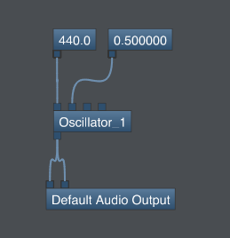
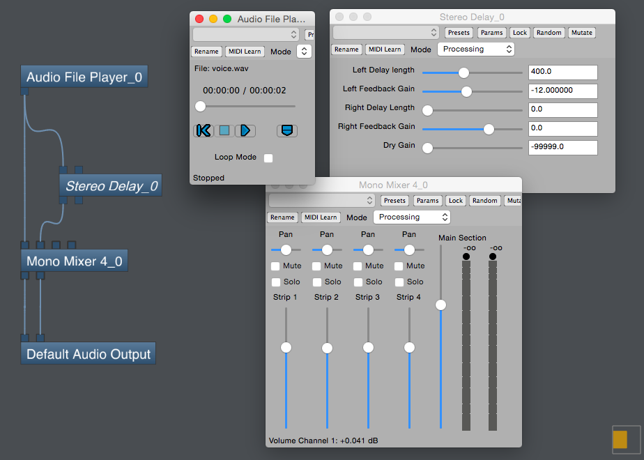

Bidule
===

# 概要

https://www.plogue.com/products/bidule.html  
https://www.plogue.com/bidule/help/index.html

インタラクティブなコンピューター音楽とマルチメディアを作成するための商用ソフトウェアアプリケーション。MaxやPure Dataのようにノードを接続してプログラミングするビジュアル言語。MIDI、OSCによる通信、ReWireデバイスとしてDAWとの連携、VST2、VST3、AUプラグインのホストといった機能を持っている。また、VSTプラグインとして機能するプラグインバージョンも用意されている。

開発はPlogue Arts and Technology社(カナダ)
モントリオール大学でコンピュータサイエンスの学位を取得したDavid ViensとSébastien Beaulieuは、2000年にPlogue社を起業してVSTプラグインを制作する。その過程で使いやすいモジュラー式VSTホストの必要性を感じBiduleが開発された。最初のリリースは2002年。

# 実装例

## サイン波生成

OscillatorノードにConstantノードでパラメータを与えてOutputに接続すると音が鳴ります。

## Delayエフェクト

Audio File Playerノードでwavファイルを再生することができます。Stereo DelayノードはWet GainがないのでDry GainをゼロにしてミキサーでDry/Wetのバランスを調整できるようにしました。

# 感想

商用製品だけあって、ReWire、VST、AUなどのサポートが充実しています。現在も頻繁にバージョンアップされており、最新のOSにも対応しています。2002年から現在まで継続的に開発されてきたソフトウェアであるためユーザー数は比較的多く、ユーザーフォーラムのコミュニケーションも盛んにおこなわれています。

シンプルでわかりやすい反面、ノード型ビジュアル言語としてはさほど独自性はなく、今回作成したようなプログラムではMax、REAKTORなどに対する明確な優位性は感じられませんでした。公式ページの情報によると、FFTで周波数領域に変換した後の操作や、マルチチャンネル、アンビソニックなどに強いことが売りのようです。また、開発当初Biduleの技術は高く評価されており、Garritan、Sibeliusといったメジャーな商用音源デベロッパーにライセンス供与され、後のPlogueとGarritanによるARIAエンジン開発につながります。

販売価格は日本円で1万円程度。バージョンアップ時に試用版も一定期間公開されます。期間限定のため時期によっては試用版をダウンロードできないことがあります。

