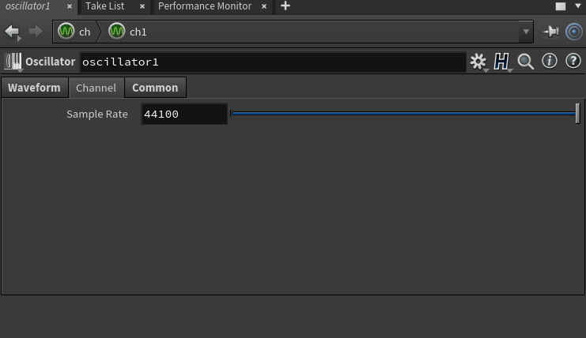

Houdini
===

# 概要

https://www.sidefx.com/products/houdini/

高精度な映画クオリティの映像制作を支援するプロシージャル3Dアニメーション制作ツール。高額な商用ソフトウェアであるが、小規模スタジオ・個人向けHoudini Indieや非商用利用向けの無料版Houdini Apprenticeなど利用しやすいプランも用意されている。

開発はSideFX社(カナダ)。Omnibus社で1980年代から開発されていたPRISMSが前身。OmnibusのKim DavidsonとGreg Hermanovicが1987年にSideFXを設立、1996年にSideFXは最初のHoudiniをリリース。2000年にGreg HermanovicはSideFXを離れ、Derivative社を設立しTouchDesignerを開発する。

# 実装例

## サイン波生成

Houdiniのオーディオ関連プログラムはCHOP Networkに作成します。

CHOP Networkノードを作成して、その中にOscillatorノードとConstantノードを配置します。Oscillatorのパラメータはデフォルトで440Hzのサイン波になっています。Amplitudeで音量を調整します。

OscillatorノードのPitch Control入力は必須なのでConstantノードを接続します。

OscillatorのChannelタブでSample Rateを44100にします。音質劣化しても問題なければ低い値にして計算負荷を下げることも可能です。

Constantノードのパラメータchan1はデフォルトの0とします。これを1にするとOscillatorは880Hz、-1にすると220Hzのサイン波を出力します。

ConstantノードのChannelタブでは、Single Frameのチェックを外して持続的に値を出力するようにします。

画面左下4番目のボタンを押してReal Time Toggleを有効にします。

画面左下のボタンを押してGlobal Animation Options画面を開きます。

Global Animation OptionsのMaintain realtime playback, possibly skipping framesを選択します。これを設定しないと再生時に音声が途切れることがあるそうです。

画面左下2番目のボタンを押してAudio Panel画面を開きます。

Audio PanelのScrubタブを選択、CHOPでoscillator1を選択します。

Playボタンを押して再生します。

## Delayエフェクト

CHOP NetworkにFile、Delay、Mathを配置して接続します。

Fileのプロパティからwavファイルを選択しておきます。

Delayノードは、パラメータ設定や接続でフィードバックループを作成することはできないようです。しかしながら、ひとつのノードで4個までシングルディレイを設定できるので、これを使ってフィードバックディレイ風にしてみました。

初回のディレイは0.4秒、ゲイン0.5とします。ch("./delay1")とすると、初回のディレイの設定値を参照できるので、2回目以降はこれを利用して計算式を入力しています。ディレイで伸びた末尾が切れないようにRemainderをMake Output Longerにします。

Mathノードのプロパティでは、Combine CHOPsの項目をAddにします。

Real Time Toggleを有効にした後に、Global Animation Optionsを開いてMaintain realtime playback, possibly skipping framesを選択します。

Audio PanelのScrubタブを選択し、CHOPでmath1を選択します。

Playボタンで再生します。

# 感想

Houdiniは基本的にはプロユースの3DCGツールで、グラフィックスに関する機能やドキュメントが充実しています。それに比べてオーディオプログラミングに関する情報は十分ではない印象です。オーディオファイル再生に合わせて波形を表示したり3Dモデルを動かすといった解説動画は多いものの、音を生成したりサウンドエフェクトに関する解説は非常に少なく試行錯誤が必要でした。

CHOPにはNoiseノードや、モジュレーションLFOなどに使えるWaveノードもあり、ある程度のオーディオプログラミングもできますが、楽ではありません。また、VEXと呼ばれるスクリプティング機能やVEXのノードベースインタフェースであるVOPもあり、これを使うことでさらに低レベルのオーディオプログラミングも不可能ではないようです。

プロジェクトファイルをシェアする場合は少し注意が必要です。商用版のプロジェクトファイルは.hip形式ですが、Houdini IndieやHoudini Apprenticeの場合、.hiplc、.hipncと異なる形式で保存され、これらを商用版Houdiniで読んでも.hip形式に変換できません。またプロジェクトファイルにはホームディレクトリ情報(Windowsの場合、C:\Users\username)が含まれるため、他人に公開するファイルからOSのアカウント名を知られたくない場合は専用のアカウントを使うなど工夫が必要になります。

