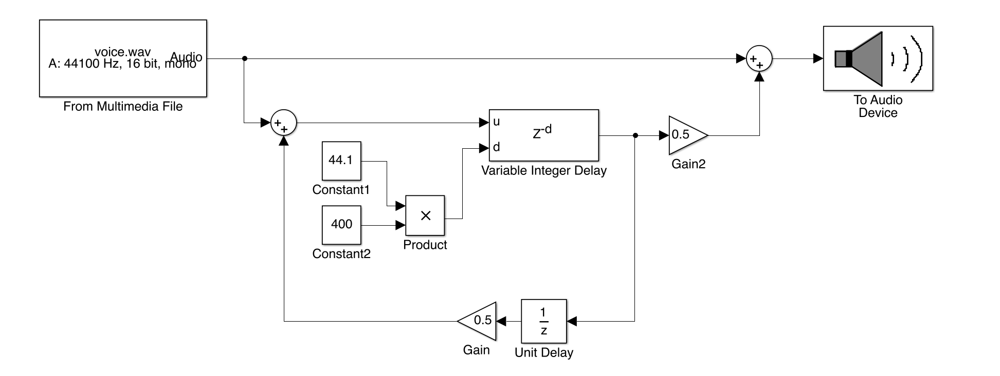

MATLAB
===

# 概要

https://jp.mathworks.com/products/matlab.html

データ解析、アルゴリズム開発、モデル作成用言語。有償。毎年更新されるので実質サブスクリプション。各種Toolboxアドオンが用意されている。Simulinkというグラフィカルモデリングツール（ビジュアル言語）もアドオンとして用意されている。

現在の開発はMathWorks（米国）。

1970年代、ニューメキシコ大学のCleve MolerがFortranに代わる言語として開発。1984年にMathWorks社を設立して商用化。

GNU Octave( https://www.gnu.org/software/octave/index )は、MATLABの基本言語部分のフリーソフトウェア版クローン。Scilab( https://www.scilab.org/ )は、MATLABに似たシンタックスを持つ言語だが互換性はない。

# 実装例

## サイン波生成

MATLABの場合、一旦配列に信号を用意して音を鳴らします。  
コロン演算子j:i:kはjからkまで増分iで配列を生成します。つまりphase = 0:1/44100:1;とすると0から1までを44100分割した44101要素の配列になります。またMATLABの多くの関数は引数に配列を与えると各要素に関数を適用した配列を返すので、ここではsin()関数の引数として配列を渡しています。

```matlab
Fs = 44100;
duration = 1;
frequency = 440;
gain = 0.3;
phase = 0:1/Fs:duration;
arr = gain * sin(2 * pi * frequency * phase);
sound(arr, Fs);
```
※GNU Octaveでもそのまま実行できます

## Delayエフェクト

ファイルから配列に信号を読み込んで、MATLABの得意な配列演算でエフェクトをかけた後に再生します。audioread関数は、以前はwavreadという名前でした。古い情報にあたるときや古いバージョンのMATLAB/Octaveを使う場合は注意してください。  
フィードバックループを作るときはUnit Delayで1サンプル分遅延させるのがポイントです。

```matlab
[y, Fs] = audioread('../voice.wav');

delayTime = 0.4;
feedback = 4;
wetLevel = 0.5;
attenuate = 0.5;

delaySample = round(delayTime * Fs); 
wet = attenuate * [zeros(delaySample, 1); y];
for i = 2 : feedback
    currentWet = power(attenuate, i) * [zeros(delaySample, 1); wet];
    wet = [wet; zeros(delaySample, 1)];
    wet = wet + currentWet;
end
y = [y; zeros(delaySample * feedback, 1)];
y = y + wet * wetLevel;

sound(y,Fs);
```
※GNU Octaveでもそのまま実行できます  

# Simulinkによる実装

MATLABと連携するビジュアルプログラミング環境Simulinkによる実装は次のようになります。  
Simulinkのファイル形式は.slxです。以前は.mdlというテキストベースのファイル形式でしたが、2012年以降バイナリの.slx形式になりました。また、同名の.slxファイルがあると.mが実行できなくなってしまうようなので別の名前で保存する必要があります。

## サイン波生成

DSP System ToolboxのSine WaveとTo Audio Deviceを使えばシンプルに実装できます。


要DSP System Toolbox

## Delayエフェクト

Variable Integer Delayでディレイ効果を作ることができます。遅延の値はサンプル数なのでサンプルレートを掛けてミリ秒からサンプル数にしています。フィードバックループを作るときはUnit Delayで1サンプル分遅延させるのがポイントです。


要DSP System Toolbox


# 感想

MATLABは歴史が長い分、最近のモダンな言語に慣れていると文法の古さや短い変数名を使用する文化に戸惑うこともあります。また最近では、毎年更新されるサブスクリプション的な購入コストの負担を嫌ってJuliaやPythonに移行する人も増えてきた印象があります。それでも現在も科学技術計算におけるデファクトスタンダードのひとつであり、ライブラリの豊富さ信頼性は圧倒的なので使えるようになって損はありません。

ここで、MATLABの買い方についても少し触れておきます。

MATLABは本体とアドオンという形式で販売され、それぞれ毎年更新されます（ソフトウェアリリースは毎年2回、ライセンスは1年単位）。個人向けや学生向けは比較的買いやすい値段です。更新しなくても古いバージョンは使えるし、言語仕様自体が大きく変更されることはないと予想できるので、一度買ってそれを使い続けるということもできます。（この辺はWaves Audio社のプラグインと似てますね）

ただし、たとえば2019年版本体で2020年版アドオンを使うことはできません。また、新版が出てから旧版対応のアドオンを購入することもできません。そのため、まず本体を買って後で少しずつアドオンを買い足すようなことはおすすめしません。必要なアドオンは本体と同時に一気に購入するのが良いと思います。

オーディオ処理でおすすめのアドオンは以下のとおりです。

* Simulink（ビジュアルプログラミング・モデリング）
* DSP System Toolbox（Simulink用オーディオ処理ライブラリ、フィルター設計、ストリーミング処理）
* Audio Toolbox（VST、ASIO、MIDIデバイス、機械学習）
* Signal Processing Toolbox（信号解析、フィルター設計）

今回の .m ファイルを実行するくらいであればMATLAB本体だけでアドオンは不要です。今回のSimulinkファイルを実行するには、MATLAB、Simulink、DSP System Toolboxが必要です。

どういった処理にどのアドオンが必要かはわかりづらいですが、公式Webに多くの情報が公開されているので根気よく読んでいけば判断することは可能です。

