Max
===

# 概要

https://cycling74.com/products/max

ノードベースのオーディオプログラミングではもっともメジャーな言語。有償。

現在の開発はCycling'74（米国）。

1980年代IRCAMに在籍していたMiller Pucketteが開発したThe Patcherが原型。
1990年にIRCAMからライセンス供与されたOpcode社がMaxの名前で商用化。その後Cycling'74社が設立され開発を継続。
またMiller Pucketteは1996年に再設計した言語Pure Dataをリリース。
Cycling'74社は2017年Abletonにより買収された。
なお、Version4（～2007年）まではMax/MSPの名前で販売されていた。

## Maxのライブラリについて

Maxは歴史が長い分ライブラリの数も膨大です。
必要なものはほぼそろっていて便利な反面、初学者は混乱するかもしれません。
ライブラリはカテゴリーごとに名前がつけられています。

* Max　言語の基本部分。算術演算やファイル操作など
* MSP　オーディオライブラリ。ノード名は末尾に\~（チルダ）がつく
* Jitter　グラフィックスライブラリ。ノード名は先頭にjit.がつく
* BEAP　MSPパッチをbpatcherでグループ化した高レベルオーディオライブラリ。モジュラーシンセに近い
* Vizzie　Jitterパッチをbpatcherでグループ化した高レベルグラフィックスライブラリ
* Gen　低レベルライブラリ。制約が多い反面高速な処理が可能。オーディオに関してはサンプルレベルの処理を記述できる

このうちGenのみ他と混在ができず、Gen patcherと呼ばれる別ウィンドウで作成したパッチを呼び出して連携するかたちになります。

# 実装例

## MSPによる実装

### サイン波生成

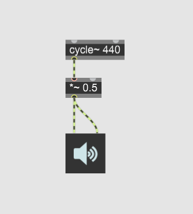

### Delayエフェクト

wavファイルを読むにはsfplay\~にopenメッセージを送るだけでも対話的にファイル指定することができます。
パッチがシンプルになるのでプログラム例ではそういった書き方をよく見かけます。
もう少し実用的に、パッチを開いたときに自動で特定のwavファイルを読んで再生するようにするには、次のようなやや複雑な処理が必要になります。

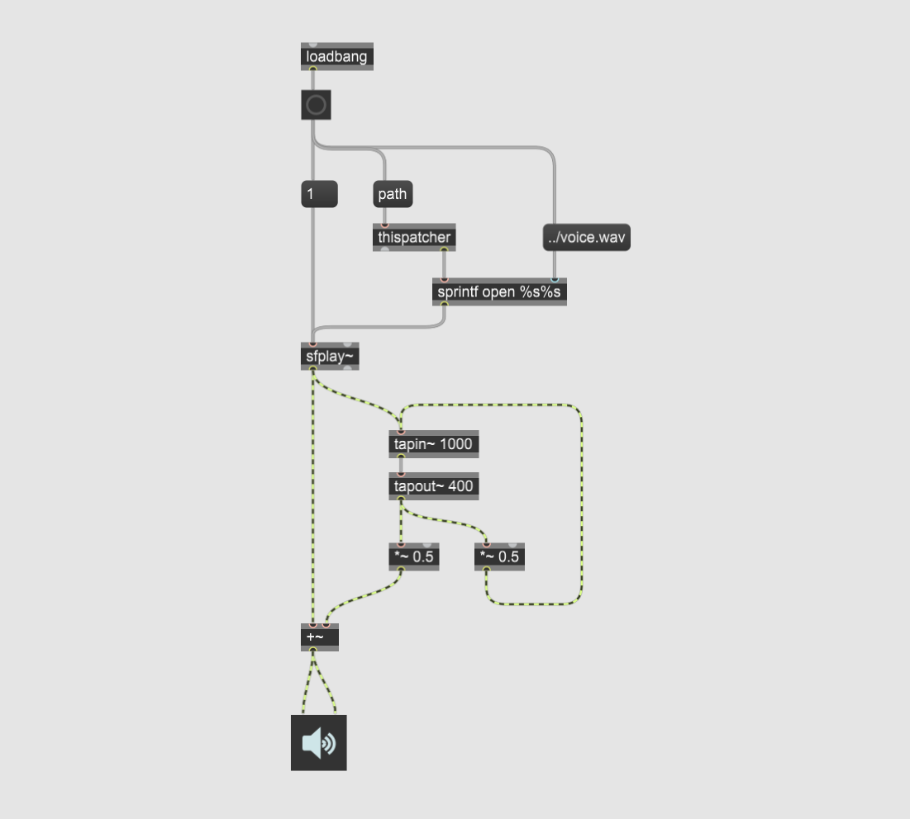

## Genによる実装

### サイン波生成

Genの場合サンプルレートから周波数を計算します。

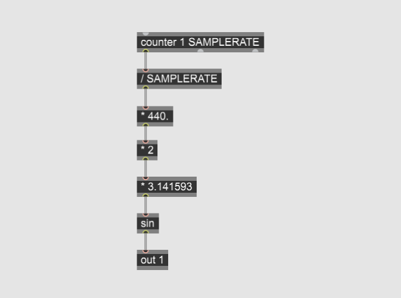

上記Genパッチを呼ぶMSPパッチ例です。
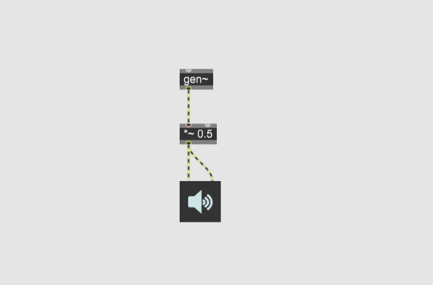

### Delayエフェクト

Genでフィードバックループを作るには、historyで1サンプル遅延させるのがポイントです。

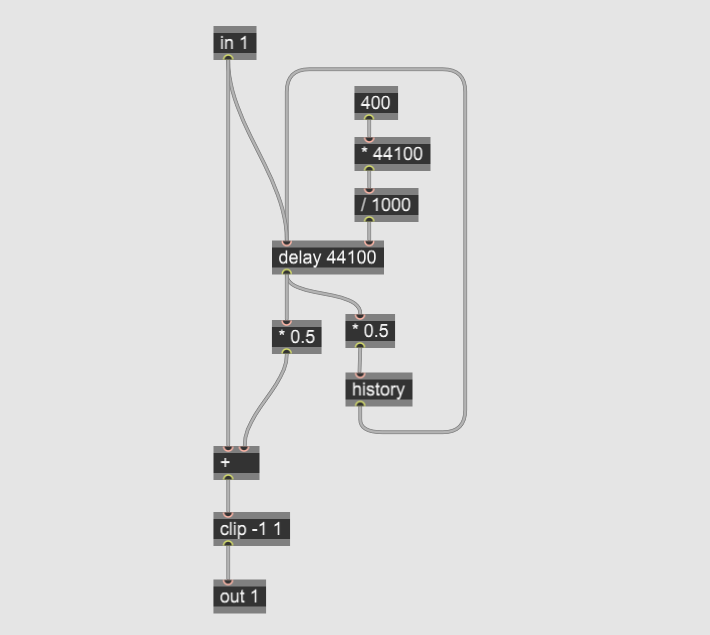

上記Genパッチを呼ぶMax/MSPパッチ例です。
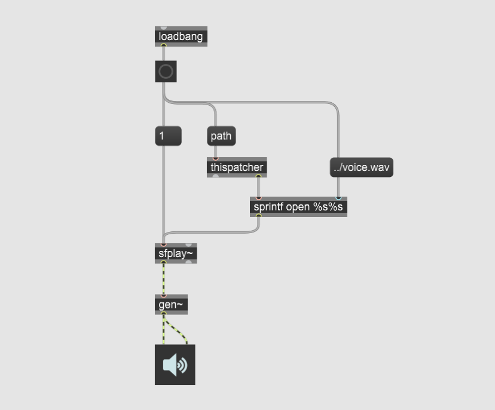

## BEAPによる実装

### サイン波生成

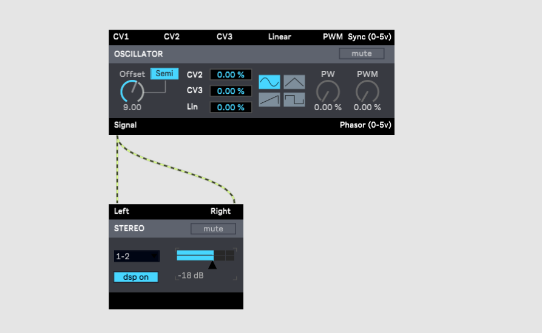

### Delayエフェクト

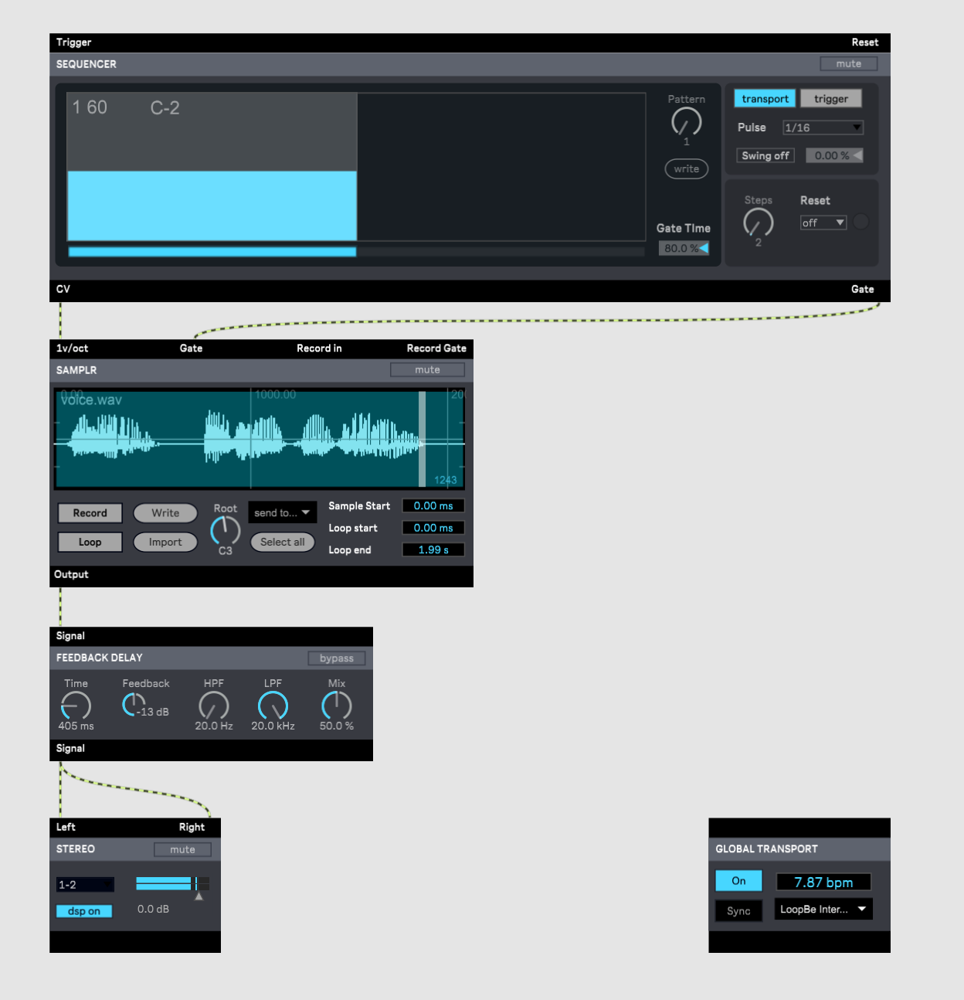

## Max for Liveによる実装

MaxはDAWであるAbleton Liveにも組み込まれています。
ここではMax for Live(M4L)と呼ばれるAbleton Live版Maxでのパッチも示します。

### サイン波生成

LiveのブラウザのCollectionsからMax for Live選択してMax Instrumentとして作成します。
M4LはDAWと連携できるのが売りなのでMIDI INとGUIをつけてみました。
周波数はGUIから設定するようにしました。MIDI Note Onで音が鳴ります

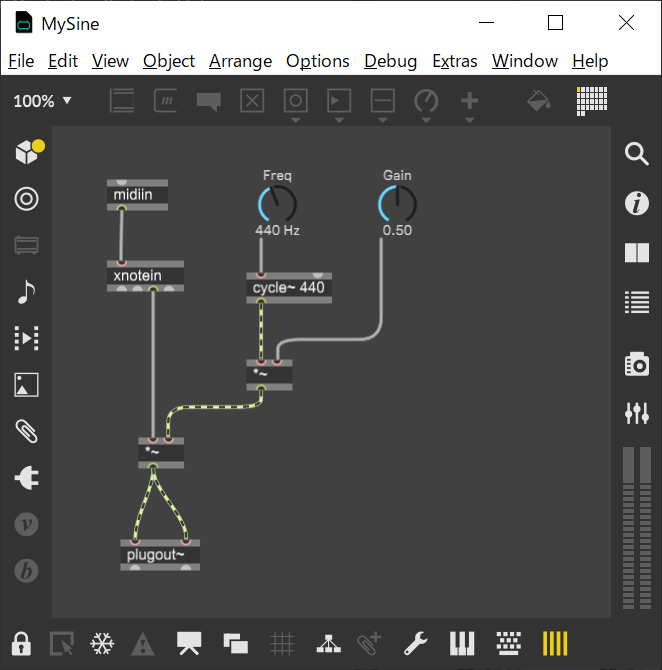

GUIはプレゼンテーション画面で調整します。

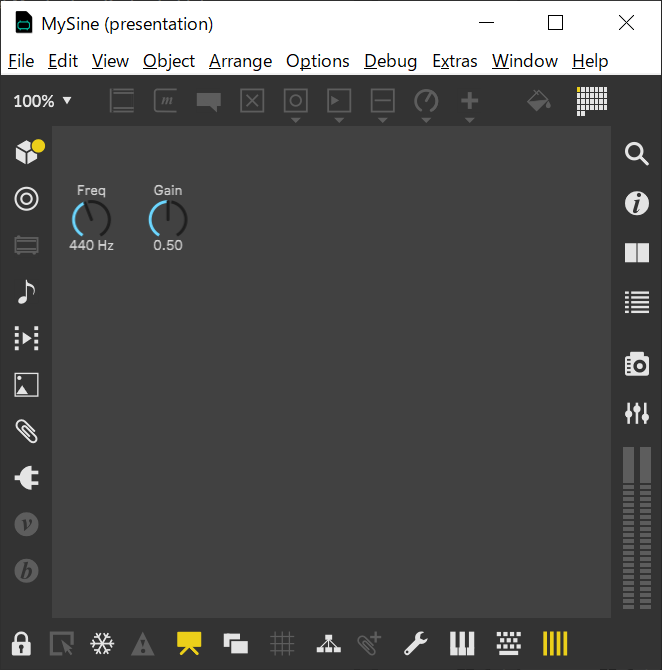

Liveの画面からはこのように見えます。

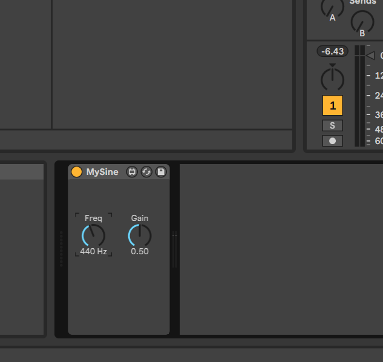

### Delayエフェクト

LiveのブラウザのCollectionsからMax for Live選択してMax Audio Effectとして作成します。
M4L版のディレイもGUIをつけてみました。実用を意識してLRそれぞれのチャンネルを別々に処理するようにしています。

プレゼンテーション画面です。

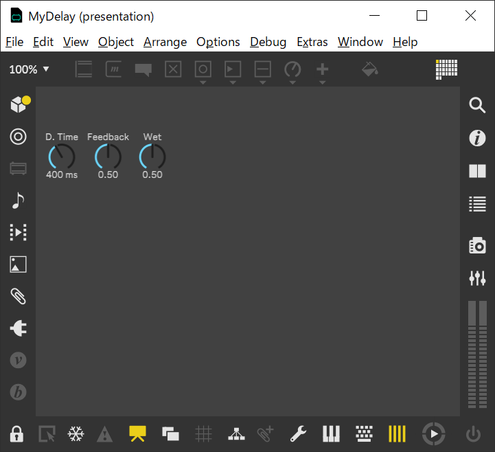

Liveの画面です。

# 感想

Maxは、ノードベースのオーディオプログラミングでは現状最良の選択肢で、エディタやライブラリも使いやすく洗練されています。
膨大なライブラリはメリットでもデメリットでもあり、ある程度経緯を知っていないと何を使えばいいのか困惑することもあります。それでも自分に必要なものから少しずつでも覚えていく価値は十分あると思います。

Max本体もMax for Liveもユーザー数が多く、コミュニティも活発で情報が得やすいのも良い点です。

無償利用できる言語が多数ある中で、比較的高価な商用製品という点は目的によっては障害となるかもしれません。
多くのPCを使用する展示作品や、大学教育で多数の学生に使わせる場合はライセンス数を気にする必要があります。

