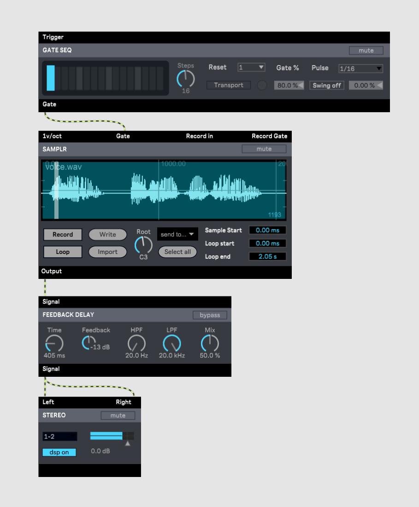

Max
===

# 概要

https://cycling74.com/products/max

ノードベースのオーディオプログラミングではもっともメジャーな言語。有償。

開発はCycling'74（米国）。

1980年代IRCAMに在籍していたMiller Pucketteが開発したThe Patcherが原型。
1990年にIRCAMからライセンス供与されたOpcode社がMaxの名前で商用化。その後Cycling'74社が設立され開発を継続。
またMiller Pucketteは1996年に再設計した言語Pure Dataをリリース。
Cycling'74社は2017年Abletonにより買収された。

Maxは歴史が長い分ライブラリの数も膨大です。
必要なものはほぼそろっていて便利な反面、初学者は混乱するかもしれません。
ライブラリはカテゴリーごとに名前がつけられています。

* Max　言語の基本部分。算術演算やファイル操作など
* MSP　オーディオライブラリ。ノード名は\~（チルダ）がつく
* Jitter　グラフィックスライブラリ。ノード名はjit.からはじまる
* BEAP　MSPパッチをbpatcherでグループ化した高レベルオーディオライブラリ。モジュラーシンセに近い
* Vizzie　Jitterパッチをbpatcherでグループ化した高レベルグラフィックスライブラリ
* Gen　低レベルライブラリ。オーディオに関してはサンプルレベルのプログラミングが可能

このうちGenのみ他と混在ができず、Gen patcherと呼ばれる別ウィンドウで作成したパッチを呼び出して連携するかたちになります。

# 実装例

## MSPによる実装

### サイン波生成

### Delayエフェクト

wavファイルを読むにはsfplay\~にopenメッセージを送るだけでも対話的にファイル指定することができます。
パッチがシンプルになるのでプログラム例ではそういった書き方をよく見かけます。
もう少し実用的に、パッチを開いたときに自動で特定のwavファイルを読んで再生するようにするには、次のようなやや複雑な処理が必要になります。

## Genによる実装

### サイン波生成

Genの場合サンプルレートから周波数を計算します。

上記Genパッチを呼ぶMSPパッチ例です。

### Delayエフェクト

Genでフィードバックループを作るには、historyで1サンプル遅延させるのがポイントです。

上記Genパッチを呼ぶMax/MSPパッチ例です。

## BEAPによる実装

### サイン波生成

### Delayエフェクト

## Max for Liveによる実装

MaxはDAWであるAbleton Liveにも組み込まれています。
ここではMax for Live(M4L)と呼ばれるAbleton Live版Maxでのパッチも示します。

### サイン波生成

M4Lの場合、せっかくなのでMIDI INとGUIをつけてみました。
周波数はGUIから設定するようにしました。MIDI Note Onで音が鳴ります

GUIはプレゼンテーション画面で調整します。

Liveの画面からはこのように見えます。

### Delayエフェクト

M4L版のディレイもGUIをつけてみました。また実用を意識してLRそれぞれのチャンネルを別々に処理するようにしています。

プレゼンテーション画面です。

Liveの画面です。

# 感想

