Orca
===

# 概要

https://hundredrabbits.itch.io/orca
https://github.com/hundredrabbits/Orca

二次元平面に文字を置いてプログラミングするライブコーディング用難解プログラミング言語。

開発はRekka & Devine。

Orca自身は音源を内蔵しておらず、MIDIやUDP通信で楽器を制御して音を鳴らす。
音源としては同じ作者のPilotシンセサイザー( https://hundredrabbits.itch.io/pilot )がよく使われる。

# 解説

Orca言語はあまりにもユニークで、今回調べた他のテキスト言語やビジュアル言語のいずれにも似ていません。
あえて似ているものを探すならライフゲーム（Conway's Game of Life）かもしれません。
そのため、実装例の前にイメージしやすいように少し解説をしておきます。

## metro

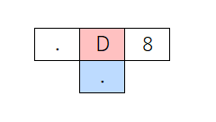

すべての基本となる定期的にBangを発生するメトロノームです。Maxのmetroに相当します。（DはDelayの意味）
正確には、フレーム数をカウントアップして右側の引数（この例の場合8）の倍数になったときに水色の位置のセルにBangを発火する、という挙動になります。
Dの左側のセルはレートで、カウントアップの速度を調整します。省略時は1で大きい値ほど遅くなります。

ORCAのコマンドは基本的にこのようなT型をしています。コマンドの左右に引数があり、コマンドの下側に計算結果をアウトプットします。
この計算結果を別のコマンドの引数になるように組み合わせて配置していくのがORCAのプログラミングです。

## Bang

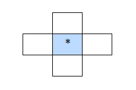

Bangの発火は*の文字で表現されます。
発火した場合、上下左右のセルに影響を与えます。
多くの場合上のセルにはBangの生成コマンドがあるので、Bangの右や下に連結することが多いです。

## カウントアップ

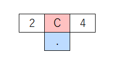

Dコマンドに似たようなものにCコマンド（Clock）があります。
フレーム数をカウントアップして水色の位置のセルに数値を出力します。
右側のセルは最大値で、4とした場合は0,1,2,3,0,1,2,3,0,…のように順番に出力されます。

## Bangの延長

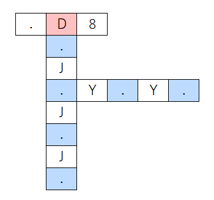

プログラムが大きくなってくるとBangが届かなくなることもあります。
その場合、JやYをつかってBangを延長することができます。
Jは下方向に、Yは右方向にセルの内容を複製します。
Bang以外でもCの出力なども複製できますが、コマンドを複製しても複製されたものはコマンドとして機能はしません。

## Bangの伝播

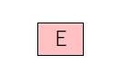

Eコマンドは1フレーム毎に右側に移動して何かにぶつかったらBangを発火します。
遠方のコマンドにドミノ倒しのトリックのようにBangを伝えるときによく使用されます。
同様のコマンドにN、S、Wがあります。それぞれ移動方向が異なりコマンド名は方角の東西南北に由来します。

## グライダーガン

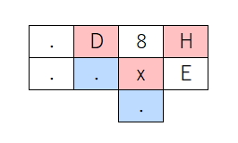

定期的にEコマンドを発射します。  
Xコマンドは右側のセルのコマンドを下のセルにコピーします。小文字でxと書くとBangに触れたタイミングでコピーするようになります。
コピー元であるxの右側のEは、そのままだと移動してしまうので上にH(Halt)コマンドを置いて機能を無効化しています。

## LFO

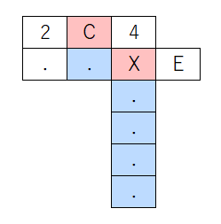

Xの左側の引数は生成位置なので、Cコマンドで連続的な数値を与えてやると位置をずらしながらEコマンドを連続生成するようになります。
結果的にEによるノコギリ波のような波形を生成します。2は波長、4は振幅のパラメータになります。
大文字でXと書いた場合は常時活性化して右側のEの機能を無効化し続けるのでHを配置する必要はありません。

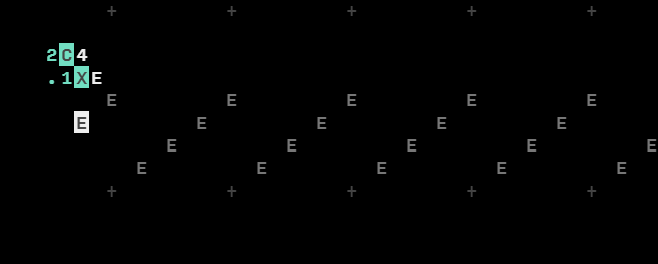

## コメント


1行コメント。#を置くとその右側に書いたものはコメントとして無効化されます。


範囲コメント。#～#で挟んだ部分がコメントになります。

## プレイヤー

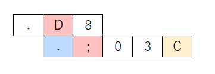

セミコロンコマンドはBangに触れると連携するシンセサイザーへメッセージを送信します。この場合黄色の位置のセルが音程を表しCの音を鳴らします。

## ランダムプレイヤー

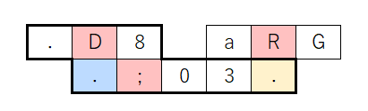

太枠部分は上のプレイヤーと共通です。
乱数発生のRコマンドを使って、音程部分をA～Gのランダムな文字列にする例です。

## メロディープレイヤー

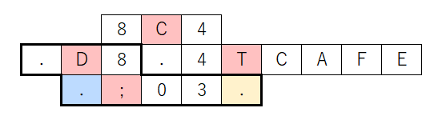

これも太枠部分のプレイヤーは共通です
Tコマンドは、全長何文字の文字列から指定位置の文字を取り出すコマンドです。
この例の場合「CAFÉ」4文字からCコマンドで指定する位置の文字を取り出します。
結果的にC、A、F、Eの文字が順番にプレイヤーに渡されメロディーとなります。


# 実装例

## サイン波生成

プログラミングはOrcaというよりPilotの制御がほとんどです。
まずデフォルトでかかっているエフェクトを切るために「BIT00」「CHO00」などのコマンドをPilotに送ります。
続いて波形をサイン波にするために「0OSCsisi」コマンドを送り、エンベロープも調整します。
Pilotの場合完全なサイン波にはならず、倍音のような音が混ざるのは仕方ないのかもしれません。
最後に「04A8f」コマンドを送ってAの音を音量8、長さfで鳴らします。

これらのコマンドを少しずつずらして送るためのOrcaプログラムを考えてみます。
中央のBang LauncherではXコマンドで右隣のEコマンドをコピーします。
コピー先のY座標を左上のCコマンドで0～6までゆっくりカウントアップします。
結果として時間をずらしてEコマンドが縦に並ぶようになります。
Eはコピーされた直後から右方向へ移動をはじめて;（セミコロン）にぶつかるとPilotにUDPでメッセージを送信します。

しかしながら、繰り返しEがコピーされ続けてしまう問題があります。
Pilotへ送信するコマンドはそれぞれ1回ずつで十分なので繰り返しは不要です。
これを阻止するのが上部のLauncher Disable Timerです。
CコマンドのカウントアップをFコマンドで常時チェックして値が8になったらBangを発生します。
このBangを受けてxコマンドが右側の空セルの内容をxの下にあるCの位置にコピーします。
結果的にCが消去されてEをコピーするY座標の数値が変化しなくなりメッセージも2回目以降は送信されなくなります。

```
.......................................................................
.......................................................................
...........6C9..#.Launcher.Disable.Timer.#.............................
............0F8........................................................
.......................................................................
.............x.........................................................
............6C7.#.Bang.Launcher.#......................................
.............0XE.....................#.Commands.#......................
.....................................;BIT00.....#.Bit.Crusher.Off.#....
.....................................;CHO00.....#.Chorus.Off......#....
.....................................;TRE00.....#.Tremolo.Off.....#....
.....................................;VIB00.....#.Vibrato.Off.....#....
.....................................;0OSCsisi..#.Set.Sine.Wave...#....
.....................................;0ENV00f0..#.Set.Envelope....#....
.....................................;04A8f.....#.Play.Note.......#....
.......................................................................
......################################.................................
......#.Sine.Wave.Generate.Program...#.................................
......#......for.Pilot.synthesizer...#.................................
......################################.................................
.......................................................................
```

## Delayエフェクト

OrcaもPilotもwavファイルを再生する機能はありません。
今回はcassetter( https://person0b.itch.io/cassetter )を使うことにします。
cassetterは、作者は異なりますがOrcaと連動することを意識して作られたプレイバックサンプラーで、デザインも通信もOrcaと大変相性が良いです。

プログラムは以下のようになります。サイン波生成とほとんど同じです。
cassetterへはMIDIでコマンドを送るので;ではなく!コマンドを使います。
cassetterはあらかじめ起動しておいてchannel 0にvoice.wavを読み込んでおきます。
読み込みファイル指定まではOrcaから送ることができません。
ディレイタイム等の設定コマンドを送った後に、「00o」コマンドでchannel 0の音を1回鳴らします。

```
.......................................................................
.......................................................................
...........6C6..#.Launcher.Disable.Timer.#.............................
............0F5........................................................
.......................................................................
.............x.........................................................
............6C4.#.Bang.Launcher.#......................................
.............0XE.....................#.Commands.#......................
.....................................!02z....#.Grain.Size.#............
.....................................!09e....#.Delay.Time.#............
.....................................!0ae....#.Feedback...#............
.....................................!00o....#.Play.Voice.#............
.......................................................................
.......................................................................
.......................................................................
.......................................................................
......################################.................................
......#.Playback.and.Delay.Program...#.................................
......#......for.cassetter.sampler...#.................................
......################################.................................
.......................................................................
```


# 感想

二次元平面のプログラミング言語という発想は非常にユニークであるだけでなく、
ソースコードの見た目がシーケンサーやリズムマシンに近くなるという点でも面白いです。

ドキュメントや公式サイトが非常に簡素なあたりも、
1文字コマンドでプログラミングするOrca言語と共通するミニマリズムを感じます。

オーディオプログラミング分野でOrca言語が意味を持つのかどうかはわかりませんが、
ライブコーディングパフォーマンス、アート、難解プログラミング言語の分野では大きな功績を残した言語であり、
今後さらに評価が高まるのではないかと思います。

