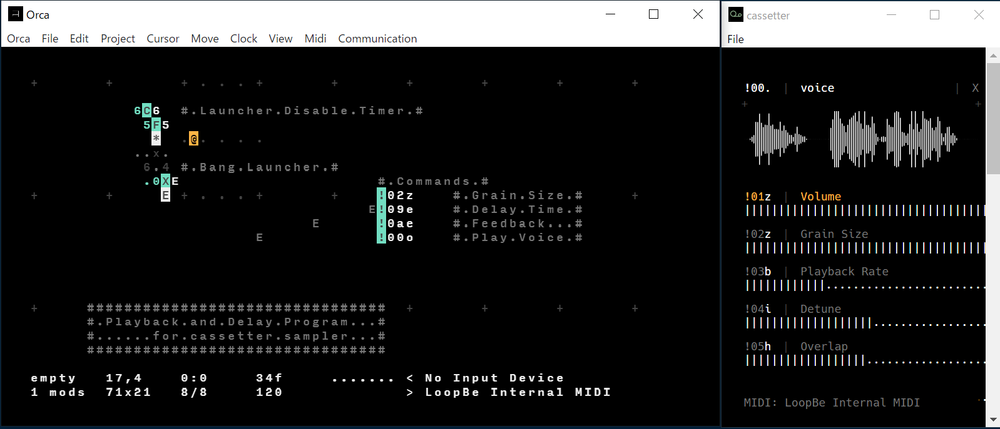

Orca
===

# 概要

https://github.com/hundredrabbits/Orca  
https://100r.co/site/orca.html  
https://wiki.xxiivv.com/site/orca.html

二次元平面に文字を置いてプログラミングするライブコーディング用難解プログラミング言語。

開発はRekka & Devine。

Orca自身は音源を内蔵しておらず、MIDIやUDP通信で楽器を制御して音を鳴らす。
音源としては同じ作者のPilotシンセサイザー( https://github.com/hundredrabbits/pilot )がよく使われる。

# 解説

Orca言語はあまりにもユニークで、今回調べた他のテキスト言語やビジュアル言語のいずれにも似ていません。
あえて似ているものを探すならライフゲーム（Conway's Game of Life）かもしれません。
そのため、実装例の前にイメージしやすいように少し解説をしておきます。

## metro


すべての基本となる、定期的にBangを発生するメトロノームです。Maxのmetroに相当します（DはDelayの意味）。
正確には、フレーム数をカウントアップして右側の引数（この例の場合8）の倍数になったときに水色の位置のセルにBangを発火する、という挙動になります。
Dの左側のセルはレートで、カウントアップの速度を調整します。省略時は1で大きい値ほど遅くなります。

Orcaのコマンドは基本的にこのようなT型をしています。コマンドの左右に引数があり、コマンドの下側に計算結果をアウトプットします。
この計算結果を別のコマンドの引数になるように組み合わせて配置していくのがOrcaのプログラミングです。  
※正しくはコマンドではなくオペレーターと呼ぶようですが、ここではわかりやすさを優先してコマンドと呼んでいます。

## Bang


Bangの発火は*の文字で表現されます。
発火した場合、上下左右のセルに影響を与えます。
多くの場合上のセルにはBangの生成コマンドがあるので、Bangの右や下に連結することが多いです。

## カウントアップ


Dコマンドに似たようなものにCコマンド（Clock）があります。
フレーム数をカウントアップして水色の位置のセルに数値を出力します。
右側のセルは最大値で、4とした場合は0,1,2,3,0,1,2,3,0,…のように順番に出力されます。

## Bangの複製


プログラムが大きくなってくるとBangが届かなくなることもあります。
その場合、JやYをつかってBangを複製することができます。
Jは下方向に、Yは右方向にセルの内容を複製します。
Bang以外でもCの出力なども複製できます。ただしコマンドを複製しても複製されたものはコマンドとして機能はしません。

## Bangの伝達


Eコマンドは1フレーム毎に右側に移動して何かにぶつかったらBangを発火します。
遠い位置のコマンドにドミノ倒しのトリックのようにBangを伝えるときによく使用されます。
同様のコマンドにN、S、Wがあります。それぞれ移動方向が異なりコマンド名は方角の東西南北に由来します。

## グライダーガン


定期的にEコマンドを発射します。  
Xコマンドは右側のセルのコマンドを下のセルにコピーします。小文字でxと書くとBangに触れたタイミングでコピーするようになります。
コピー元であるxの右側のEは、そのままだと移動してしまうので上にH(Halt)コマンドを置いて機能を無効化しています。

## LFO


Xの左側の引数は生成位置なので、Cコマンドで連続的な数値を与えてやると位置をずらしながらEコマンドを連続生成するようになります。
結果的にEによるノコギリ波のような波形を生成します。2は波長、4は振幅のパラメータになります。
大文字でXと書いた場合は常時活性化して右側のEの機能を無効化し続けるのでHを配置する必要はありません。


## コメント


1行コメント。#を置くとその右側に書いたものはコメントとして無効化されます。


範囲コメント。#～#で挟んだ部分がコメントになります。

## プレイヤー


セミコロンコマンドはBangに触れると連携するシンセサイザーへメッセージを送信します。この場合黄色の位置のセルが音程を表しCの音をBangのたびに鳴らします。

## ランダムプレイヤー


太枠部分は前項のプレイヤーと共通です。
乱数発生のRコマンドを使って、音程部分をA～Gのランダムな文字列にして鳴らす例です。

## メロディープレイヤー


これも太枠部分のプレイヤーは共通です。
Tコマンドは、全長何文字の文字列から指定位置の文字を取り出すというコマンドです。
この例の場合「CAFE」4文字からCコマンドで指定する位置の文字を取り出します。
結果的にC、A、F、Eの文字が順番にプレイヤーに渡されメロディーとして演奏されます。


# 実装例

## サイン波生成

プログラミングはOrcaというよりPilotの制御がほとんどです。
まずデフォルトでかかっているエフェクトを切るために「BIT00」「CHO00」などのコマンドをPilotに送ります。
続いて波形をサイン波にするために「0OSCsisi」コマンドを送り、エンベロープも調整します。
Pilotの場合完全なサイン波にはならず、倍音のような音が混ざるのは仕方ないのかもしれません。
最後に「04A8f」コマンドを送ってAの音を音量8、長さfで鳴らします。

これらのコマンドを順番に送るためのOrcaプログラムを考えてみます。
中央のBang Launcherは前述したLFOです。
少しずつずらして生成されたEは右方向へ移動をして;（セミコロン）にぶつかるとPilotにUDPでメッセージを送信します。

しかしながら、Pilotへ送信するメッセージはそれぞれ1回ずつで十分なのでLFOによる繰り返しは不要です。
これを阻止するのが上部のLauncher Disable Timerです。
CコマンドのカウントアップをFコマンドで常時チェックします。FはIFの意味で左右の値が同じになったらBangを出力します。
今回の場合カウントアップの値が8になったらBangが発火します。
このBangを受けて、下にあるxコマンドがxの右側の空セルの内容をxの下のCの位置にコピーします。
結果的にCが消去されてコピー先座標の数値が変化しなくなり2回目以降のメッセージは送信されなくなります。

```
.......................................................................
.......................................................................
...........6C9..#.Launcher.Disable.Timer.#.............................
............0F8........................................................
.......................................................................
.............x.........................................................
............6C7.#.Bang.Launcher.#......................................
.............0XE.....................#.Commands.#......................
.....................................;BIT00.....#.Bit.Crusher.Off.#....
.....................................;CHO00.....#.Chorus.Off......#....
.....................................;TRE00.....#.Tremolo.Off.....#....
.....................................;VIB00.....#.Vibrato.Off.....#....
.....................................;0OSCsisi..#.Set.Sine.Wave...#....
.....................................;0ENV00f0..#.Set.Envelope....#....
.....................................;04A8f.....#.Play.Note.......#....
.......................................................................
......################################.................................
......#.Sine.Wave.Generate.Program...#.................................
......#......for.Pilot.synthesizer...#.................................
......################################.................................
.......................................................................
```

## Delayエフェクト

OrcaもPilotもwavファイルを再生する機能はありません。
今回はcassetter( https://person0b.itch.io/cassetter )を使うことにします。
cassetterは、作者は異なりますがOrcaと連動することを意識して作られたプレイバックサンプラーで、デザインも通信もOrcaと大変相性が良いです。ディレイエフェクトを内蔵しているのでこれを利用します。

プログラムはサイン波生成とほとんど同じです。
cassetterへはMIDIでコマンドを送るので;ではなく!コマンドを使います。
アプリ間でMIDI通信できるように、macOS付属のIAC DriverやWindowsのLoopBe1のようなツールで仮想MIDIを用意しておきます。
cassetterはあらかじめ起動してchannel 0にvoice.wavを読み込んでおきます。
読み込みファイル指定まではOrcaから送ることができません。
Orcaプログラムでは、ディレイタイム等の設定コマンドを送った後に「00o」コマンドでchannel 0の音を1回鳴らしています。

```
.......................................................................
.......................................................................
...........6C6..#.Launcher.Disable.Timer.#.............................
............0F5........................................................
.......................................................................
.............x.........................................................
............6C4.#.Bang.Launcher.#......................................
.............0XE.....................#.Commands.#......................
.....................................!02z....#.Grain.Size.#............
.....................................!09e....#.Delay.Time.#............
.....................................!0ae....#.Feedback...#............
.....................................!00o....#.Play.Voice.#............
.......................................................................
.......................................................................
.......................................................................
.......................................................................
......################################.................................
......#.Playback.and.Delay.Program...#.................................
......#......for.cassetter.sampler...#.................................
......################################.................................
.......................................................................
```




# 感想

二次元平面のプログラミング言語という発想は非常にユニークであるだけでなく、
ソースコードの見た目がシーケンサーやリズムマシンに近くなるという点でも面白いです。

作者は漫画家兼ライターとプログラマー兼ミュージシャンで、世界中を航海しながらソフトウェア作品を作っているそうです( https://100r.co/site/about_us.html )。
そういったライフスタイルやアート思考が、ユニークでミニマルな言語設計に反映されているようにも思います。

なお、以前のバージョンではBコマンドがsubtract(減算)ではなく、最小値と最大値の間でインクリメントとデクリメントを繰り返すbounceとなっていました。
ネット上の解説やサンプルプログラムには両方の記述が混在しているので注意してください。

オーディオプログラミング分野でOrca言語が意味を持つのかどうかはわかりませんが、
ライブコーディングパフォーマンス、テクノロジーアート、難解プログラミング言語の分野では大きな功績として今後さらに評価が高まるのではないかと思います。

