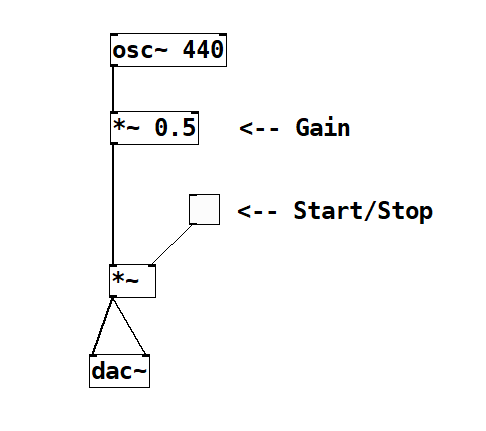
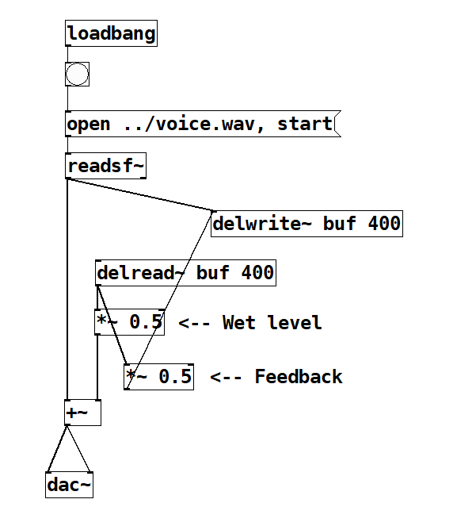

Pure Data
===

# 概要

https://puredata.info/

マルチメディア用のオープンソースのビジュアルプログラミング言語。

Maxの原型の開発者でもあるMiller Pucketteが1990年代に開発。

# 実装例

## サイン波生成

特に説明は必要ないくらいシンプルです。

## Delayエフェクト

wavファイル再生はreadsf\~にopenメッセージを送ります。
ディレイはdelwrite\~でバッファ書き込み、delread\~でバッファ読み込み。
*\~で音量調整、+\~でミックス。

# 感想

Pure Dataは第一印象でGUIが地味と感じるかもしれません。
ですが、慣れてくるとこれはあえてこういう設計なのだと思えてきます。

Maxをはじめリッチなビジュアルプログラミング環境がある中で、
Pure Dataの価値のひとつはサウンドエンジンの軽さとポータビリティにあるように思います。
自作のプログラムやシステムにサウンドエンジンを載せたいとき、
Pure Data（のGUIを除いた部分）は良い選択肢のひとつです。
そういう点で、Luaのような組み込み用言語と考えることもできます。

また、オープンソースであるだけでなく、ノードの仕様もドキュメントが整備されているため独自ノードが作りやすく、
自作のハードウェア制御などにも使いやすい構造になっています。

そのあたりがわかってくると、ビジュアルプログラミングの楽しさ演出よりも、
GUIとエンジンを切り分けて、プログラムの利用しやすさ、軽さを重視しているストイックな設計も魅力に思えてきます。

とはいえ、用意されているノードだけでは微妙にかゆいところに手が届かないと感じることもあります。
そのため本流（Vanilla）以外にさまざまな便利機能を追加した拡張Pure Dataが存在します。
少し前まではPd-extendedが有力でしたが開発が止まったため、現在はPurr Dataがその位置にあります。
Vanilla自体もいまだに更新され続けていて、新しいOSにも対応し使いやすさも向上し続けています。

Purr DataのWeb版も公開されました（ http://cuinjune-purr-data.glitch.me/ ）。
これまでも、無償ということもあって大学教育などで利用されていましたが、Web版でさらに敷居が下がることが期待されます。

長年揉まれてきただけあり、完成度の高い現役の言語だと思います。

