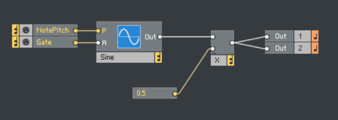
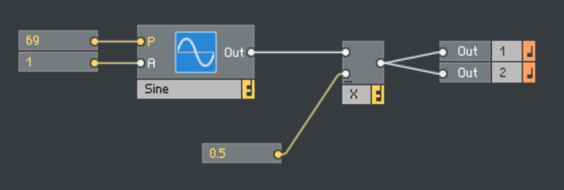
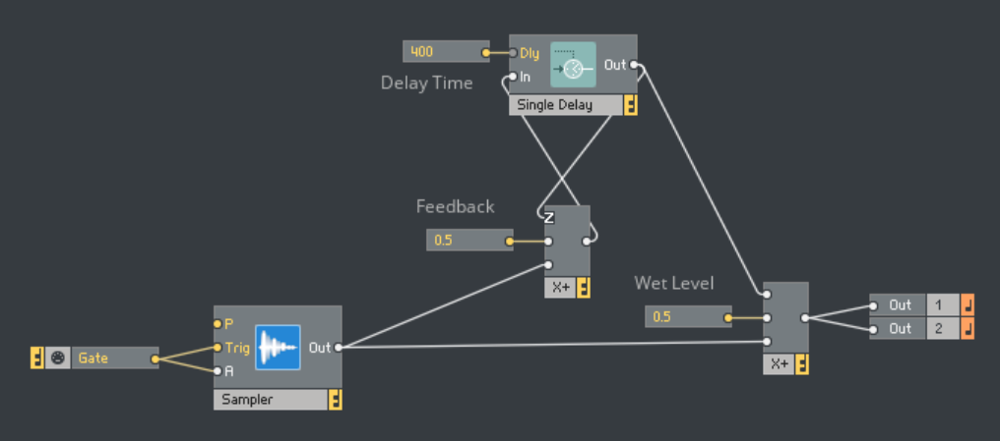
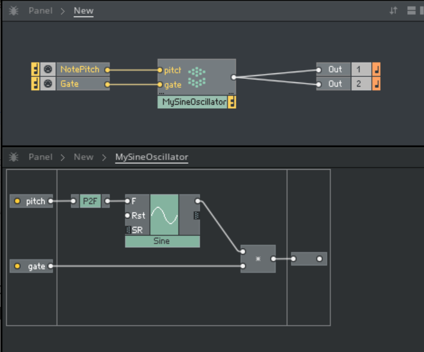
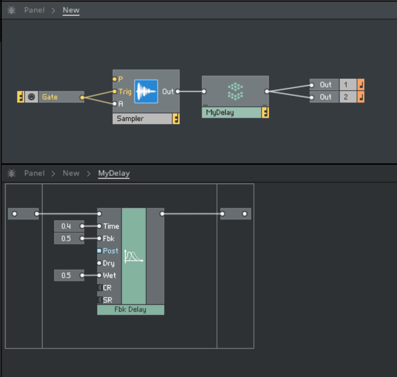
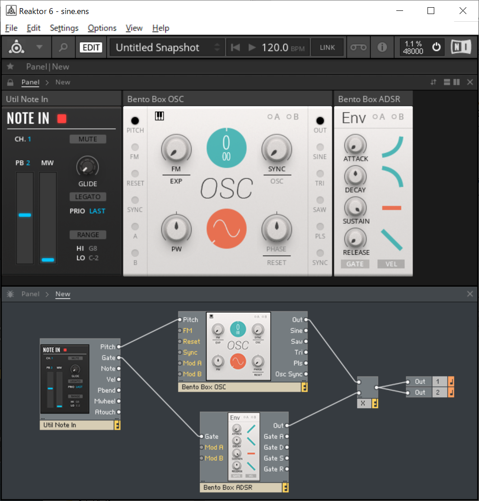
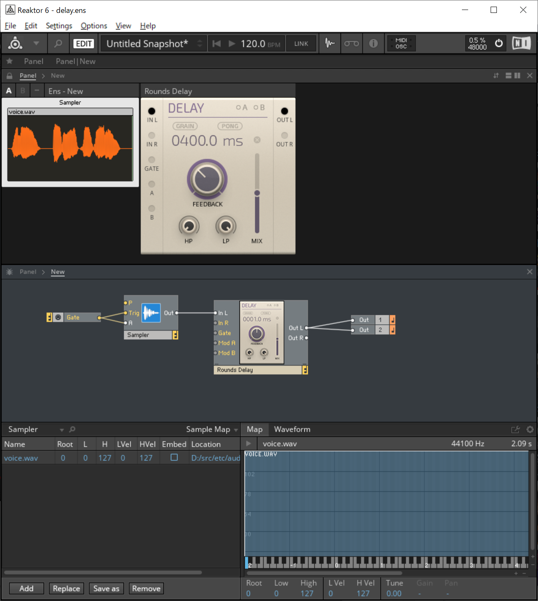
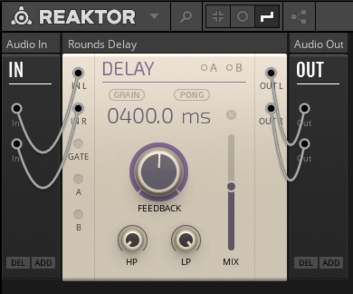

REAKTOR
===

# 概要

https://www.native-instruments.com/jp/products/komplete/synths/reaktor-6/

シンセサイザー、エフェクト、サウンドツール等を作成するためのビジュアルプログラミング環境。Native Instruments社の製品。Native Instrumentsの商用シンセサイザーにはREAKTORで作成されたものもある。

1996年Native Instruments最初の製品としてGeneratorの名前でリリース。1999年のバージョンアップ時にREAKTORと改名する。2003年に初版が発売された人気バンドル製品KOMPLETEにも含まれている。

通常のオーディオプログラミングの他に、低レベルプログラミング用のCore、モジュラーラックを模したBlocksが用意されており、それぞれMaxで言うところのGen、BEAPに相当する。また2019年のVersion6.3ではRackというBlocksの新形式がリリースされた。RackはGUI操作とパッチコード操作が画面切替なしにできるなど操作性が向上している一方、従来のノードとの互換性はなくなった。

# 実装例

## 通常のパッチによる実装

Ensemble Structureと呼ばれる通常のパッチ画面です。

## サイン波生成

MIDIキーボードで弾いた音程のサイン波を出力します。

MIDIキーボードを使わずに440Hz(＝ノートナンバー69)の音を鳴らす場合は左側の入力を次のようにします。

## Delayエフェクト

フィードバックディレイは用意されていないのでSingle DelayのOutを分岐してフィードバックループを作成しています。X+(Mult/Add)ノードは入力a,b,cからa*b+cを計算して出力します。入力端子のZはREAKTORが自動的にフィードバックループを検知して1サンプル遅延させていることを意味します。

## Coreによる実装

CoreではライブラリのSineやFbk Delayが用意されているので実装は簡単ですが、このSineやFbk DelayもCoreで作成されており、中を見ていくとプリミティブなパーツだけでサイン関数やフィードバックディレイを実現していることがわかります。

## サイン波生成

画面上半分はCoreを呼ぶEnsemble Structure、下半分がCoreプログラミングの画面です。

CoreのIn/Outには扱う信号がAudioかEventかの区別があり、プロパティで正しく設定する必要があります。下のpitchやgateのようにオレンジ色の丸はEvent、出力側のように白い丸はAudioを示しています。

## Delayエフェクト

こちらもFbk Delayを使うだけなのでシンプルです。

## 旧型式Blocksによる実装

従来タイプのBlocksはBlocks(Legacy)と呼ばれており、今後はRackが主流になるようです。ノブを操作する画面とパッチコードを操作する画面が分かれているのは確かに不自然ではあります。

## サイン波生成

サイン波をそのままGateでON/OFFするとクリックノイズが出るのでADSRで立ち上がりをわずかに滑らかにしています。

## Delayエフェクト

Blocks以外のノードと混在できるのは従来タイプのBlocksの利点です。以下の例ではSamplerノードからBlocksのRounds Delayに接続しています。

## 新形式Blocksによる実装

新形式RackでのBlocksの例です。GUIパネルとパッチコードがひとつの画面になっていて自然に見えます。Rackでシンセサイザーやエフェクターを作るにはRack対応したBlocksモジュールで完結する必要があります。

## サイン波生成

旧型式のように数学関数ノードでの信号処理はできないためADSRでVCAをコントロールして音量調節しています。VCAはパネル上部の「A」を選択したときにLEVELノブの右側に現れる半透明のスライダーを上にスライドさせることでエンベロープのゲートとして機能するようになります。

## Delayエフェクト

フィードバックディレイはRounds Delayをそのまま使えますが、Rack対応のプレイバックサンプラーが用意されていないため簡単には実装できませんでした。DAWで前段にサンプラーを接続してディレイエフェクトをかけるようなことは可能です。

# 感想

REAKTORも1990年代から続く歴史があり、その分複雑になっている印象があります。通常のパッチを使うだけであれば、十分なライブラリと詳しいドキュメントがありアプリも安定しているので良いプログラミング環境だと思います。

Coreに関しては、公式情報は比較的多いもののわかりづらい部分も多く、高いスキルを必要とする印象です。逆にいうと製品レベルのシンセサイザーを作るような高度なオーディオ処理を、ビジュアルプログラミングだけで実現するという本気度合いが感じられます。

Blocksは公式モジュールだけで楽器として使うには現状でも十分だと思いますが、プログラミング環境の延長として考えると制限が多い印象です。

ノードベースのビジュアルプログラミングはどうしても編集モード／実行モードの切り替えが必要になります。編集モードで操作するパッチコードと実行モードで操作するGUIを、モジュラーシンセのように切り替えなしに扱えるようにすることは、どのプラットフォームも苦労しているようです。Maxでは編集モードにOperate While Unlockedというサブモードを用意することで対応しました。vvvvでは左クリックと右クリックをそれぞれ編集／実行操作に割り当てることで対応しています。REAKTORのRackではそれを従来のノードプログラミング環境と非互換にすることで解決しようとしています。

Rack対応の自作Blocksモジュールは最近になってようやく作れるようになったようですが、Rack自体新しい仕様でありまだまだ情報が少ないため使いこなしてプログラミングするには現状ハードルが高いように感じました。

