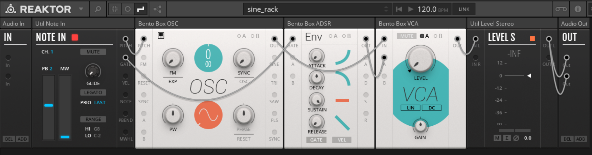

REAKTOR
===

# 概要

https://www.native-instruments.com/jp/products/komplete/synths/reaktor-6/

シンセサイザー、エフェクト、サウンドツール等を作成するためのビジュアルプログラミング環境。Native Instruments社の製品。
Native Instrumentsの商用シンセサイザーにはREAKTORで作成されたものもある。

通常のオーディオプログラミングの他に、低レベルプログラミング用のCore、モジュラーラック用のBlocksが用意されており、Maxで言うとそれぞれGen、BEAPに相当する。
また2019年のVersion6.3よりRackというBlocksの新形式がリリースされた。
RackはGUI操作とパッチコード操作がモード切替なしにできるなど操作性が向上しているが、従来のノードとの互換性はなくなった。

# 実装例

## 通常のパッチによる実装

## サイン波生成

## Delayエフェクト

## Coreによる実装

## サイン波生成

## Delayエフェクト

## 旧型式Blocksによる実装

## サイン波生成

## Delayエフェクト

## 新形式Blocksによる実装

## サイン波生成

## Delayエフェクト

# 感想

