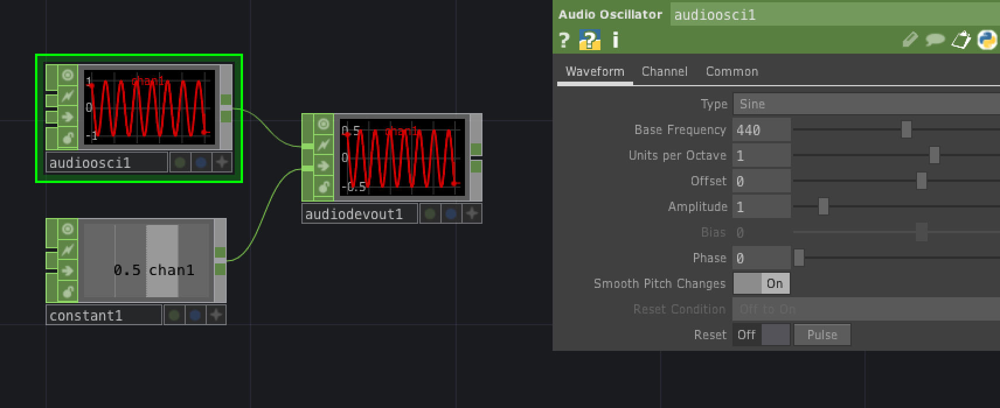
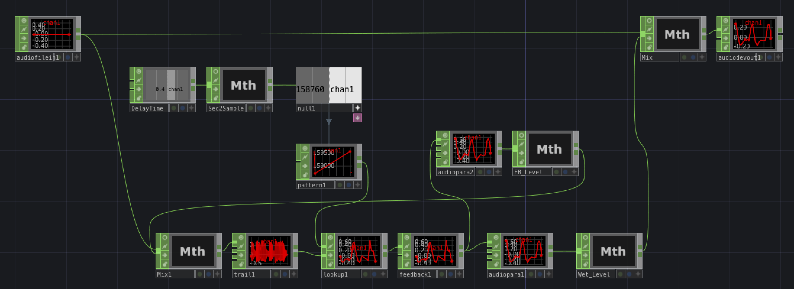

TouchDesigner
===

# 概要

https://derivative.ca/

インタラクティブにマルチメディアコンテンツを作成するためのノードベースビジュアルプログラミング言語。
クリエイティブコーディングに使用される。

開発はDerivative社(カナダ)。

# 実装例

## サイン波生成

TouchDesignerのオーディオ関連ノードはCHOPカテゴリーにまとまっています。
CHOPのAudio OscillatorとAudio Device Outを接続すると音が出ます。
周波数はAudio Oscillatorのプロパティから設定、音量はConstantをAudio Device Outに接続して調整するようにしました。

## Delayエフェクト

CHOP Delayノードは音声信号を遅らせるだけでフィードバック機能がないので別の方法でフィードバックループを作成しました（参考： https://www.youtube.com/watch?v=80leysTaskg )

wavファイル再生はAudio File In、そこからディレイ用に分岐した音声を下段のMathノード(Mix1)につなぎます。後続のTrailノードが遅延用に信号を記憶するバッファです。  

フィードバックディレイは本来Trailが想定している使い方とは異なるらしく、バッファをLookupノードで読むには少し工夫が必要になります。どこからどこまでどのようにという情報をPatternノードで与えてやります（Type:Ramp、Sample Rate:44100、Length:735、Amplitude:735）。LookupのWindow LengthはTrailのデフォルトバッファサイズである176400、Index Rangeを0～176400とします。(176400 = 44100 * 4、つまり4秒)  
後続のFeedbackはOutput:Previous Channels at Current Timeとします。

ここからが理解しづらいのですが、その後ろに何も設定しないAudio Para EQを接続しています。これを接続しないと正常な音になりません。一旦正常な音が出たら外してもかまいません。今回は説明用に外さずにそのままにしてあります。  

中段右のMathはFeedback Levelで、プロパティから0.5倍して入力側に戻しています。TouchDesignerのフィードバックループは、接続やパラメータを間違えると不安定になることもあるので注意して接続してください。  
下段のMathはWet Levelで、こちらもプロパティから0.5倍しています。

中段左のConstant(DelayTime)はディレイタイム設定用です。右隣のMath(Sec2Sample)で44100をかけてサンプル数にして、さらに右隣のNullからExpressionでPetternのOffsetにつないで制御できるようにしています。

右下のWet Levelの出力を上段のMathでDryとミックスすれば完成です。

# 感想

TouchDesignerはエディタ画面の操作が気持ちよくできるように考えられている印象です。
拡大縮小やスクロール、入れ子構造の行き来だけでも他のビジュアル言語にはない快適さがあります。各ノードを追加するのも一覧がすぐ出てくるので、記憶をたどったり、詳細マニュアルを見たりせずにどんどんプログラミングできます。
各ノードのビジュアル表現や背景のビジュアル設定なども派手で楽しいので、エディタ画面をそのまま投影してパフォーマンスすることもあるようです。

オーディオプログラミングに関しては、パフォーマンスや作品制作用途に必要な基本的な部品は大体そろっています。ディレイに関しては今回のフィードバックディレイはやりすぎで、普通にDelayノードを使うのが良いと思います。  

常時動かしながらノードを接続していくのがTouchDesignerのスタイルだと思いますが、今回のフィードバックディレイのようにサンプル単位で複雑なオーディオプログラミングをすると、プログラムのバグや設定ミスでアプリが固まってしまうこともあります。そういった作業をするときは実行を止めて一旦セーブしてから接続するような慎重さが必要かもしれません。

あとは、各ノードのプロパティで設定しているパラメータが重要であることが多く、スクリーンショットだけではプログラム内容が伝わりづらいということを感じました。

