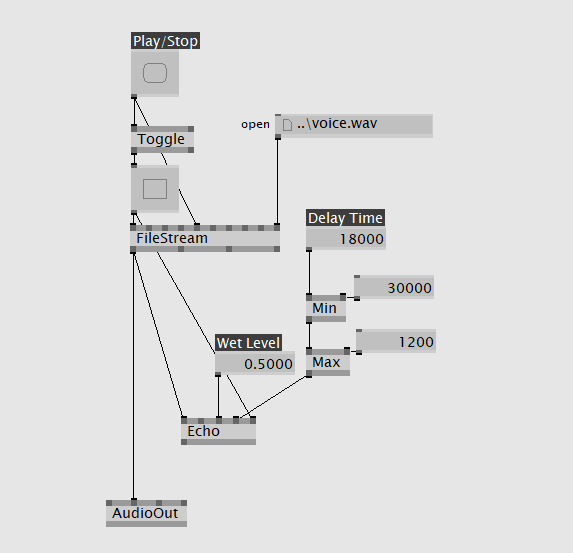

vvvv
===

# 概要

https://vvvv.org/

プロトタイピングと開発のためのビジュアル・テキストハイブリッド言語。
VJパフォーマンスなどにも使われる。
Windows専用。商用利用は有償。

開発はvvvv group。

# 実装例

vvvvでオーディオプログラミングするには、いろいろと注意点があります。
オーディオライブラリにはDShow9/Bass/VAudioなどの系列があり、お互いに混ぜて使用することはできません( https://betadocs.vvvv.org/topics/audio/index.html )。
結論から言うと、VAudioライブラリがおすすめです。
ASIOまわりでバグるとOSを巻き込んで不安定になるわずらわしさは少々ありますが、ノードも充実しており32bit/64bitともに安定して動きます。

## サイン波生成

## VAudioライブラリ

VVVV.Audio pack( https://vvvv.org/contribution/vvvv.audio-pack-alpha )をインストールすることで使えるようになります。インストール方法はvvvvインストールフォルダ直下にpacksフォルダごとコピーします。  
32bit/64bitどちらでも使えます。
ASIO必須なのでオーディオインタフェースハードウェアを使っていない場合、ASIO4ALLのインストールが別途必要になります。
パッチの中でAudioEngineノードを使用してASIOデバイスを指定します。

### DShow9ライブラリ

デフォルトでインストールされています。32bit/64bitどちらでも使えます。
DShowライブラリは提供されるオーディオノードが少なく、オシレーターは作成できないようです。

### Bassライブラリ

addonpack( https://vvvv.org/downloads#addonpack )をインストールすることで使えるようになります。インストール方法はvvvvインストールフォルダ直下にaddonpackフォルダごとコピーします。  
64bit版ライブラリが提供されておらず、32bit版vvvvでのみ使えます( https://vvvv.org/documentation/missing-in-64bit-builds )。
各種エフェクトなどのノードが豊富です。

Bassライブラリは、エフェクターノードは豊富ですがオシレーターは作成できないようです。

## Delayエフェクト

## VAudioライブラリ

右上の独立したノードはASIOの初期化とバッファの作成。
ファイルから読み込んだ音声は中央のBufferWriterでバッファに書き込まれます。
Play/Resetボタンを押すとバッファの0位置にシークしてから書き込むのがポイントです。
一方で中央左下のBufferReaderは普段は停止していてPlay状態になってから0.4秒後に動き始めます。
BufferReaderの出力をWet LevelとFeedbackに分岐して、Feedback成分をBufferWriterに送ります。
VAudioは＊や＋で音声信号を加工できるので楽ですね。

### DShow9ライブラリ

DShow9では基本的に音声信号のエフェクトができないので、複数のFileStreamに時間をずらしてbangを送ることでディレイ効果を実現してみました。

### Bassライブラリ

BassライブラリにはEchoノードが用意されています。  
フィードバックは1回のみ。Wetのみ取り出すことは不可。
また、オーディオグラフはループ構造を許可していないらしく、接続を工夫してフィードバックを作り出すことはできないようです。
ディレイタイムの単位も不明です。20000にすると400msecくらいになります。上限値下限値も説明がありませんが、調べたところ1200～30000のようです。
AudioOutはDShow9と同名ですが、BassライブラリのAudioOutは接続するinletの場所が異なることに注意してください。

## VSTプラグイン

vvvvはVST2プラグインが使えるのでエフェクトは外部プラグインにまかせる方法もあります。  

## VAudioライブラリ

VAudioライブラリは32bit/64bit VST2プラグインに関して相性問題もなく安定して動きます。
プラグインはファイル名で指定するのでどこに置いてあってもかまいません。vvvvが64bitの場合プラグインも64bit VST2を指定します。

### DShow9ライブラリ

DShow9ライブラリでVST2を利用する場合、32bit版vvvvを使う必要があるようです。
(vvvvインストールフォルダ)\lib\nodes\vst\ にVST2 32bitプラグインファイルを置いておくと、プラグインの名前のノードが作成できるようになります。
ただし、プラグインによってはDAWで使用したときと音が異なったり、パラメータ設定が音にうまく反映されなかったり相性の悪い部分があるようです。

インスペクターの赤丸の位置をチェックするとinletが追加されてパラメータを数値ノードから設定できるようになります。

### Bassライブラリ

BassライブラリもVSTノードがあるのですが( https://vvvv.org/documentation/vst-(bass-dsp) )、今回サンプルプログラムを参考にどう設定しても音を鳴らすことができませんでした。サンプルプログラムもうまく動きません。

# 感想

メニューの出し方やマウスクリックの挙動が一般のアプリと異なっているため、最初は戸惑いますがすぐに慣れます。
MaxやPureDataのような編集モード／実行モードの切り替えがなく、マウスの左右ボタンが編集／実行に対応しているのでモードを意識せず高速にプログラミングできて快適です。

また、bangボタンやtoggleボタンのようなMaxやPureDataでおなじみのボタンも、微妙に挙動が異なるので注意が必要です。
toggleの下にbangを接続するとbangはtoggleのように1を送り続け、bangの下にtoggleを接続するとtoggleはbangのように一瞬だけ1を送るようになります。

公式ドキュメントに、「ぶっちゃけvvvvはオーディオ処理にフォーカスしていないよ」とあるとおり( https://betadocs.vvvv.org/topics/audio/index.html )、オーディオ関係の機能はいろいろと穴があり、複雑なオーディオプログラミングにはあまり向いていない印象です。

一方で映像＋音のパフォーマンス用にシンプルなオーディオプログラムを使う場合は、VAudio+VSTプラグインが安定していて利用しやすいと思います。

